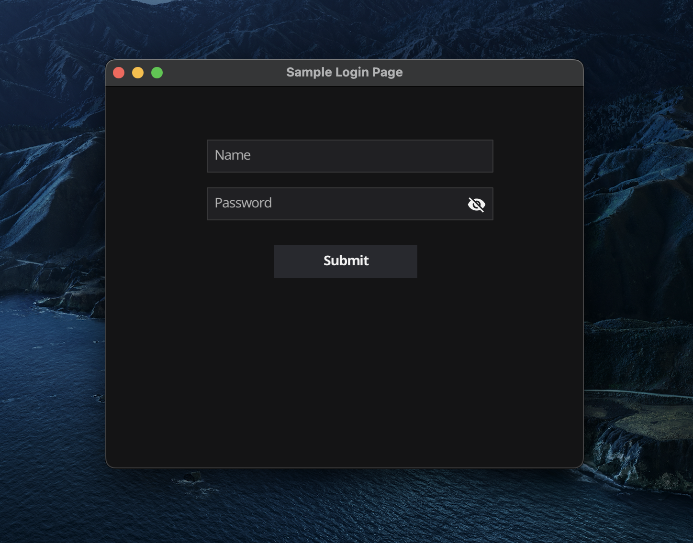

# golang-gui
a simple login page using fyne.io package

## Description
This project is used fyne.io[https://fyne.io/] package to create a simple login page.

## How to run the project
After cloning the project, run the following command in the project directory
```go run main.go```

## The Image of the sample login page

